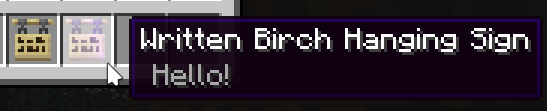

# SilkSigns

**A Minecraft Paper plugin that allows picking up written signs with the Silk Touch enchantment.**

## Features

* Works with floor signs, wall signs, and hanging signs
* Front and back text are preserved
* Optionally unwax waxed signs when dropped as an item
* Sign contents are copied to item lore to identify them in the inventory
* Permissions to always drop written signs, even without Silk Touch and in creative mode
* Configurable name format and enchantment glint for written signs
* Configurable tool enchantment and level

## Installation and Usage

**Requires Paper or a fork for Minecraft 1.20.6+**

* Download the latest [release](https://github.com/joshuaprince/SilkSigns/releases)
* Place it in your plugins folder
* Run the server once and see the generated `SilkSigns/config.yml` for configuration options

### Permissions

| Permission                 | Default   | Description                                                            |
|----------------------------|-----------|------------------------------------------------------------------------|
| `silksigns.break`          | Everyone  | Allow use of silk touch tools to receive written signs                 |
| `silksigns.break.creative` | No One    | Drop written signs as items when broken, even in creative mode         |
| `silksigns.break.notool`   | No One    | Drop written signs as items when broken, even without using silk touch |
| `silksigns.place`          | Everyone  | Allow placement of written signs previously obtained with silk touch   |
| `silksigns.reload`         | Operators | Allow use of /silksigns reload                                         |

### Commands

`/silksigns reload` - Reload config.yml
